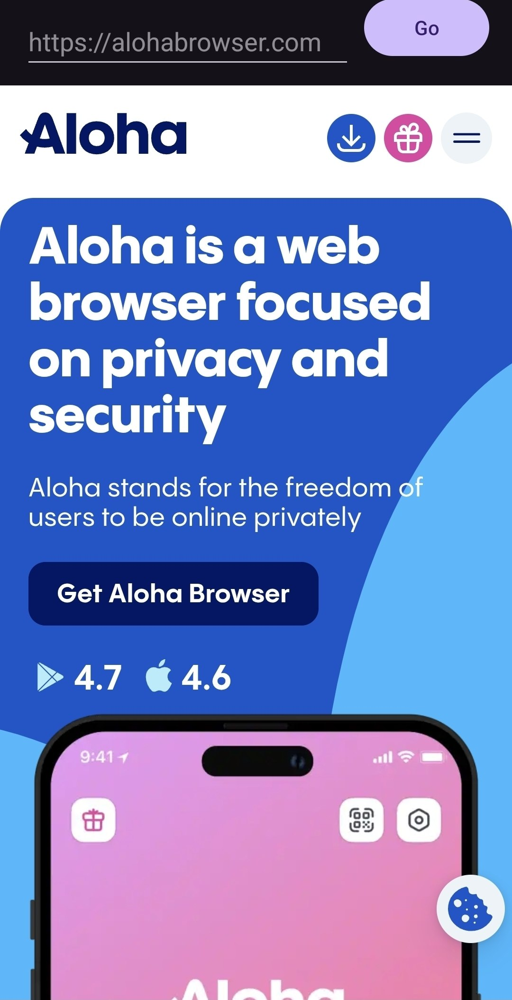

# AlohaCore Demo

A minimal Android demo application that showcases [AlohaCore](https://alohabrowser.com) —
Aloha Browser's custom Android WebView built on top of Chromium.

Unlike the system `android.webkit.WebView`, AlohaCore exposes the lower-level
Chromium `AwContents` API, which gives the embedder full control over rendering,
navigation, and content handling. On top of that, AlohaCore adds:

- **Built-in ad blocker** — network-level filtering of ads and trackers.
- **Multimedia API** — hooks for intercepting media playback, extracting streams
  (including HLS), and integrating with a custom media pipeline.

This demo wires up the minimum needed to load URLs in an `AwContents`-based
WebView, so it can be used as a starting point for embedding AlohaCore in a
standalone application.

## Screenshot

After launching the app, you should see a URL bar at the top and the
`alohabrowser.com` homepage rendered by AlohaCore below it:



## Requirements

- Android SDK with API 36 installed
- JDK 21 (the Gradle daemon is configured to use JetBrains Runtime 21)

## Project layout

```
.
├── app/                    # the demo application module
│   ├── build.gradle.kts
│   └── src/main/
│       ├── AndroidManifest.xml
│       ├── java/com/alohamobile/alohacore/demo/
│       │   ├── AlohaCoreDemoActivity.kt      # URL bar + WebView container
│       │   ├── DemoApplication.kt            # AlohaCore initialization
│       │   ├── internal/
│       │   │   ├── AwSettingsFactory.kt      # AwSettings configuration
│       │   │   ├── DrawFnAccess.kt           # GPU draw functor bridge
│       │   │   ├── InternalAccessDelegateImpl.kt
│       │   │   └── MinimalAwContentsClient.kt  # stub AwContentsClient
│       │   └── view/
│       │       └── SimpleAlohaCoreWebView.kt # ScrollView-based AwContents host
│       └── res/
├── build.gradle.kts        # root build script
├── buildSrc/               # shared SDK version constants
├── gradle/
│   └── libs.versions.toml  # dependency version catalog
└── settings.gradle.kts
```

## AlohaCore AAR

The demo depends on the AlohaCore native AAR, which is **not** included in
this repository. Get it in one of two ways:

- **Download a pre-built release** from
  <https://github.com/AlohaBrowser/aloha-core/releases> and save the `.aar`
  somewhere on your machine.
- **Build from source** using the AlohaCore repository at
  <https://github.com/AlohaBrowser/aloha-core>; follow the build instructions
  there to produce `aloha-bromium-localbuild.aar`.

Then point the dependency in `app/build.gradle.kts` at your AAR. Replace the
`PATH_TO_ALOHA_CORE_AAR` placeholder with the absolute path to the directory
that contains the file:

```kotlin
implementation(files("PATH_TO_ALOHA_CORE_AAR/aloha-bromium-localbuild.aar"))
```

## Build & run

```sh
./gradlew :app:assembleDebug
./gradlew :app:installDebug   # with a device/emulator connected
```

The produced APK is large (~400 MB) because it bundles the full Chromium
runtime for all supported ABIs.

## How it works

1. `DemoApplication.onCreate()` calls `BromiumInitializer.initializeAll(...)`
   which loads native libraries and boots the Chromium process.
2. `AlohaCoreDemoActivity` constructs an `AwContents` instance, wires it to a
   `SimpleAlohaCoreWebView` (a `ScrollView` that forwards all view callbacks to
   `AwContents.viewMethods`), and loads a URL.
3. `MinimalAwContentsClient` provides no-op implementations of all
   `AwContentsClient` callbacks — override these to integrate navigation,
   download, permission, or media events into your app.

## Notes

- Resource compression for `.bin`, `.pak`, and `.dat` files is disabled in
  `app/build.gradle.kts`; AlohaCore opens them via file descriptor, which
  requires them to be stored uncompressed in the APK.
- `AwContents` holds native resources. Always call `awContents.destroy()` in
  `Activity.onDestroy()` (see `AlohaCoreDemoActivity`).
- The `config_key_system_uuid_mapping` string-array in
  `app/src/main/res/values/not_translatable.xml` configures the
  key-system → DRM-UUID mapping that AlohaCore uses during MediaDRM
  initialization. **The array can be left empty** — the demo will still launch
  and load regular HTTP(S) pages. Only encrypted media playback (e.g. Widevine
  EME) that depends on this mapping is affected when it's empty. See the
  comment in that file for the entry format.
